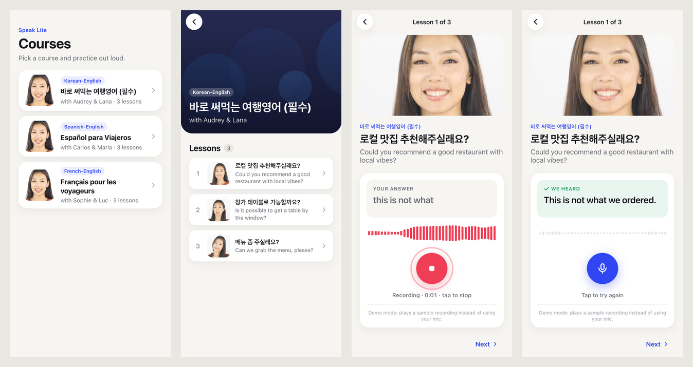

# speak-lite

A small, mobile-first language learning app. You can browse courses, open a lesson, and tap **Record**
to stream audio over a WebSocket to Speak's speech recognition (ASR) service, watching the
transcription update live as it streams back. Not an official Speak product.



- **Client:** React 19 + TypeScript, built with Vite, routed with React Router. Mobile-only layout.
- **Server:** Node.js + TypeScript with Express (REST) and `ws` (WebSocket proxy).

## Prerequisites

- **Node.js 22 or newer** (see `.nvmrc`; with nvm, run `nvm use`)
- npm 10+ (ships with Node 22)

## Setup

```bash
npm install
cp server/.env.example server/.env
```

`server/.env.example` already contains the WebSocket host and credentials, so the copy is all
the configuration you need.

## Running

### Development

```bash
npm run dev
```

Then open **http://localhost:5173**. This runs the API server on port 3001 and the Vite dev
server on 5173. Vite proxies `/api` and `/ws` to the API server, so the browser talks to a
single origin, just like in production. Use your browser's device toolbar (or a phone-sized
window): the UI is built for mobile viewports only.

### Mock ASR mode (no network needed)

```bash
npm run dev:mock
```

Same as above, except the proxy connects to a local mock ASR server instead of the staging host.
See [the note below](#a-note-on-the-staging-asr-host) for why this exists.

### Production build

```bash
npm run build
npm start
```

Then open **http://localhost:3001**. Express serves the built client, the REST API, and the
WebSocket from one port. (Add `ASR_MODE=mock` in front of `npm start` to use the mock.)

### Tests and type checks

```bash
npm test
npm run typecheck
```

Tests cover the parts that are easiest to break: the proxy (end to end against a real socket pair), the REST API, the recording state
machine, and the audio helpers.

## Configuration

All server configuration is read from environment variables, loaded from `server/.env` when
the file exists. Real environment variables take precedence.

| Variable           | Default                | Description                                                     |
| ------------------ | ---------------------- | --------------------------------------------------------------- |
| `PORT`             | `3001`                 | Port for the REST API, WebSocket proxy and (in production) the client. |
| `ASR_MODE`         | `live`                 | `live` proxies to `ASR_UPSTREAM_URL`. `mock` starts a local stand-in. |
| `ASR_UPSTREAM_URL` | required in `live`     | Upstream ASR WebSocket, `wss://api.usespeak-staging.com/public/v2/ws`. |
| `ASR_ACCESS_TOKEN` | required in `live`     | Sent as the `X-Access-Token` header on the upstream handshake.  |
| `ASR_CLIENT_INFO`  | `Speak Interview Test` | Sent as the `X-Client-Info` header.                             |

The access token only lives on the server. The browser never sees it.

## A note on the staging ASR host

As of October 6, 2026, the staging host accepts the WebSocket handshake but answers every
`asrStart` with:

```json
{ "type": "asrError", "message": "matchingRequired" }
```

I tried the payload exactly as documented, plus a few hundred variations (other lesson and line
ids, locales, and likely field names such as `matching`, `matchingText` and `expectedText`, at
the top level and inside `metadata`). They all got the same reply. Streaming audio after the
error gets nothing back. The access token doesn't seem to be checked (a wrong one gets the same
reply), but `X-Client-Info` is required (without it the handshake fails with a 502). My guess is
the API now expects a matching field that isn't publicly documented.

So the app still works end to end, `ASR_MODE=mock` starts a
local WebSocket server (`server/src/asr/mockUpstream.ts`) that follows the documented protocol:

- It refuses handshakes that are missing the two headers, like the real host, so the proxy's
  header injection is still exercised.
- `asrStart` returns `asrMetadata`, or `asrError` if a session is already active.
- `asrStream` produces interim `asrResult`s as words are "heard". Timing comes from how much
  audio has actually arrived, using word timestamps from transcribing the sample clip
  offline. (It says "This is not what we ordered.")
- `isFinal: true` produces the final result and ends the session. Stopping early gives a
  shorter final result, just like a real recognizer.

The proxy and client are identical in both modes. In live mode the app shows the upstream error
in the recording panel instead of failing silently.

## Architecture

```
Browser (React)                     Node server                         Upstream ASR
───────────────                     ───────────                         ────────────
CoursesPage ─┐
CoursePage  ─┼── GET /api/... ────▶ Express ──▶ CourseRepository
LessonPage  ─┘                                  (course.json, frozen)
   │
RecordingPanel
   │ useRecordingSession (reducer)
   ▼
RecordingController ── WS /ws/asr ──▶ AsrProxy ── WS + X-Access-Token ──▶ wss://api.usespeak-
   ▲     │                           (1 upstream per      X-Client-Info      staging.com/...
   │     └─ MockMicrophone            browser socket)                        (or local mock)
   │        (assets/audio.json,
   │         real-time pacing)
   └──────── asrMetadata / asrResult / asrError / proxyError ◀───────────────────────┘
```

```
shared/            Types shared by client and server (course entities, REST shapes, ASR protocol)
server/
  data/            course.json (the read-only "database")
  src/
    index.ts       Wires config, repository, HTTP server and proxy together
    app.ts         Express app: /api routes, JSON 404s/errors, static client in production
    config.ts      Env parsing with fail-fast errors
    courses/       Repository (load + deep-freeze) and REST routes
    asr/           WebSocket proxy, client message validation, mock upstream
  test/            Proxy and API integration tests
client/src/
  pages/           One component per route
  components/      Recording panel, top bar, loading/error states, icons
  asr/             Socket wrapper, recording controller, session reducer, error copy
  audio/           Mock microphone and PCM helpers (decoding, duration, level)
  api/, hooks/     Typed fetch helpers and a small async-data hook
```

### REST API

The course data is exposed read-only. It's loaded once at startup and deep-frozen, and there are
only `GET` routes.

| Route                                        | Response                                                         |
| -------------------------------------------- | ---------------------------------------------------------------- |
| `GET /api/courses`                           | `{ courses: CourseSummary[] }`: course fields plus `lessonCount`, no lesson list |
| `GET /api/courses/:courseId`                 | `{ course: Course }` with its lessons                            |
| `GET /api/courses/:courseId/lessons/:lessonId` | `{ course: CourseSummary, lesson, position, previousLessonId, nextLessonId }` |
| `GET /api/health`                            | `{ ok: true }`                                                   |

Unknown ids return `404 { error: { code: "notFound", message } }`. Lessons are nested under
their course, so a lesson can't be fetched through the wrong course. The list endpoint returns
summaries so the catalog stays small as courses grow, and the lesson endpoint returns everything
the lesson page needs in one request (including prev/next for navigation).

### WebSocket proxy (`server/src/asr/proxy.ts`)

Browsers can't set custom headers on a WebSocket handshake, so the server does it:

- **One upstream connection per browser connection.** An upgrade on `/ws/asr` dials the upstream
  host with `X-Access-Token` and `X-Client-Info`. Messages are relayed verbatim in both
  directions, so the proxy doesn't need to understand ASR results.
- **Validation before forwarding.** Browser messages must be JSON `asrStart` or `asrStream`
  messages of the right shape and under 64 KB. Anything else gets a `proxyError` back and is
  never forwarded with our credentials.
- **Buffering during the handshake.** Messages that arrive while the upstream is still
  connecting are queued (bounded) and flushed on open, so the client can send `asrStart` right
  away.
- **Linked lifetimes.** If either side closes, the other is closed too. Reserved close codes
  like 1006 are mapped to 1011. If the upstream can't be reached, the client gets
  `proxyError: upstreamUnavailable` before the close.
- **Heartbeat.** Browser sockets are pinged every 30 seconds, and ones that stop answering are
  terminated so dead upstream connections don't pile up.
- Every connection gets a short id in the logs (`[asr-proxy 1a2b3c4d] upstream open...`).

### Recording experience (client)

- **`MockMicrophone`** stands in for real capture. It lazily loads `audio.json` (code-split, so
  the 160 KB clip isn't in the main bundle), decodes each chunk once to get its duration and
  loudness, and emits chunks at real-time pace (each chunk is about 31 ms of 16 kHz audio),
  scheduled against the start time so timer drift doesn't build up. Stopping early sends the
  next chunk immediately with `isFinal: true`. Replacing it with a real microphone would only
  mean producing the same stream of chunks.
- **`RecordingController`** is plain TypeScript, not React. It owns the socket, the mic and the
  protocol timers: it sends `asrStart`, starts the mic on `asrMetadata`, forwards chunks, and
  ends the session on the final `asrResult`. Keeping this outside React means the protocol logic
  doesn't depend on render timing or StrictMode double effects.
- **`sessionReducer`** is a pure state machine
  (`idle → connecting → recording → finishing → done`, with `error` reachable from any active
  state). Only the most recent transcription is kept: each result replaces the last one.
- **Failure handling.** There are timeouts for `asrMetadata` (8 s) and the final result (5 s;
  if it never comes, the last partial result is kept). Upstream `asrError`s and `proxyError`s
  are mapped to readable messages, and a dropped connection shows "Connection lost". After any
  failure the socket is closed, so a stale message from an old session can't leak into the next
  one. Successful sessions reuse the open connection.
- **Feedback.** A live waveform and a halo around the button follow the input level. Interim text
  is shown in grey with a cursor, and the final text in a green "We heard" card. There's an
  elapsed timer, and the button doubles as stop.

### Decisions and tradeoffs

- **Express + Vite over Next.js.** The core of this exercise is a long-lived WebSocket proxy,
  which fits a plain Node server better than Next.js route handlers. Vite gives a fast dev loop,
  and in production Express serves the built client so everything runs on one origin.
- **Shared types, no shared runtime.** `shared/` holds the protocol and API types, so the client
  and server can't drift apart. The server runs TypeScript directly with `tsx`, which keeps the
  setup simple. A real deployment would compile it ahead of time.
- **A transparent proxy over a "smart" one.** The proxy validates and relays messages but doesn't
  rewrite them. That makes it easy to reason about, and protocol changes upstream (like
  `matchingRequired`) don't need proxy changes.
- **No data-fetching library.** With three read-only endpoints, a small `useAsync` hook
  (abortable, with retry) was enough. With more endpoints or caching needs I'd use TanStack Query.

## Roadmap

- **Real microphone input** via an `AudioWorklet` that downsamples to 16 kHz PCM and produces the
  same chunks as `MockMicrophone`.
- **Feedback on the learner's speech:** compare the transcript with the lesson's target phrase,
  highlight missed words, and track attempts per lesson.
- **Reconnect with backoff** and a visible connection status, and resuming a session that drops
  partway through if the upstream supports it.
- **Proxy hardening:** rate limiting and a per-IP connection cap, backpressure checks on
  `bufferedAmount`, structured logs and metrics (session length, time to first result, error
  rates).
- **Testing:** component tests for the recording panel and a Playwright run through the whole
  flow against the mock.
- Support the `matchingRequired` field in live mode once its format is known.
